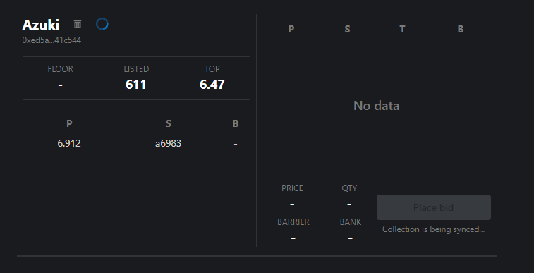

# Blurrator

🪙🖼️🤖

## Overview

Blurrator is an automated bidding assistance tool for the Blur.io NFT marketplace, implemented during Season 2 of the Blur.io Airdrop program. This tool is available as a Google Chrome extension and significantly simplifies the bidding process on Blur.io by providing a centralized, all-in-one control panel for both reading information and performing quick actions that are not possible with the original Blur.io UI.

Blurrator also features an automated bid watcher that adjusts the current bid value based on the highest bid, preventing the user's bid from being liquidated. The tool offers a flexible set of configurations for automated bidding and a set of useful information on open bids including collection name, floor price, current top bid, user's bid, bid quantity, and total bid value, along with action hot buttons.

## Getting started

00 Install dependencies

```bash
yarn install
```

### Running in dev mode

01 Run dev mode

```bash
yarn dev
```

02 Project will be built into `/build` folder

03 Enable development mode on chrome extensions page

04 "Upload unpacked extension" by selecting `/build` folder

### Building the extension

01 Run build

```bash
yarn build
```

02 Project will be built and archived into `/zip/blurrator-0.2.0.zip`

03 You can now share the build as a .zip archive

## Using the extension

### Initial settings

1. Click a Blurrator extension icon in the extension bar
2. To open the Dashboard, click the first button in the opened pop-up
3. To start using the Dashboard Private key and Alchemy API key must be set in the settings menu, as well as the total bank used in bidding

### Adding a collection

1. To add a collection click "Add collection" button in the top right corner of the dashboard
2. Fill in collection display name and collection contract address copied from Blur
3. After collection is added, as syncing process is started (Note that syncing may take a long time, depending on the collection activity)
4. After syncing is finished you are ready to place a bid
5. You can remove collection by click a trash bin next to the collection name (your bids on the collection are removed automatically)

\
_Collection card in syncing process_

### Placing a bid

1. In order to place a bid click "Place bid" button in the bottom right corner of the collection card.
2. Input bid price, quantity and barrier (used for automated bid moving and represents an allowed difference between user's bid and the top bid in ETH)
3. Confirm your bid by clicking "Place bid" button
4. You can now see your bid in the bid book window highlighted with green color
5. You also have a set of buttons controlling quick actions of your bid, with ability to turn on automated bid watching

## Disclaimer

The software is provided "AS IS", without warranty of any kind, express or implied, including but not limited to the warranties of merchantability, fitness for a particular purpose and noninfringement. In no event shall the authors or copyright holders be liable for any claim, damages or other liability, whether in an action of contract, tort or otherwise, arising from, out of or in connection with the software or the use or other dealings in the software. Use of this software is at your own risk. The author assumes no responsibility for any financial loss or damages caused by the exploitation or failure of this software.

---

**&copy; 2024 steezy | All rights reserved.**

_This project is licensed under the [MIT License](https://opensource.org/license/mit/). For more information, please see the license file._

_Connect with me: [GitHub](https://github.com/steezydev) • [LinkedIn](https://www.linkedin.com/in/ivanilichevv/) • [Telegram](https://t.me/steezydev)_

_Crafted with ❤️ and a pursuit of excellence._
